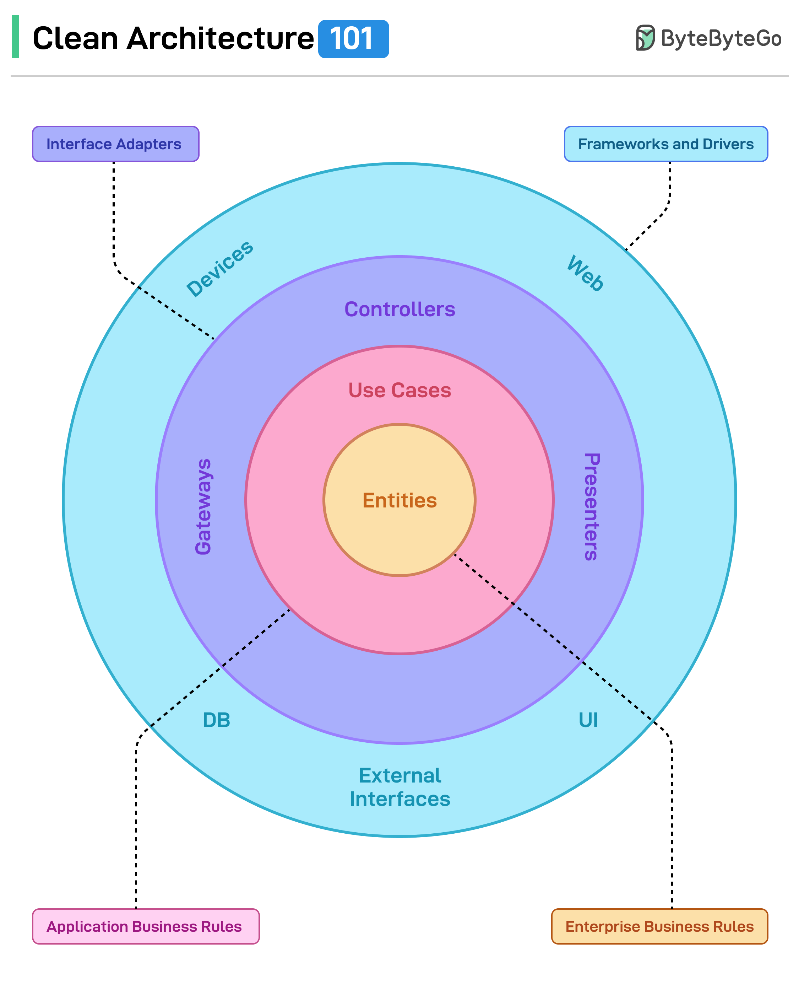

<h1 style="display: flex; justify-content: space-between; align-items: center;">
   Company Employees Web API
  
</h1>
A production-ready ASP.NET Core Web API built using Clean Architecture principles, implementing advanced REST features such as HATEOAS, JWT authentication, caching, and rate limiting.

---

## 📌 Overview

This project is a complete backend system for managing companies and their employees. It follows best practices for scalable API design and includes real-world features typically required in enterprise applications.

The application is structured using Onion Architecture to ensure clear separation of concerns, maintainability, and scalability.



Built as a hands-on implementation inspired by the Code Maze Web API architecture.

---

## 🧱 Architecture

The solution follows **Onion Architecture**, ensuring separation of concerns and maintainability.

### 🔹 Project Structure

- **CompanyEmployees.Presentation** – API controllers & configuration
- **CompanyEmployees** – Main startup project
- **Entities** – Domain models
- **Contracts** – Repository interfaces
- **Repository** – Data access layer (EF Core)
- **Service.Contracts** – Service interfaces
- **Service** – Business logic implementation
- **Shared** – DTOs, helpers, and utility classes
- **LoggerService** – Custom logging abstraction

---

## ⚙️ Tech Stack

- ASP.NET Core Web API
- Entity Framework Core
- SQL Server
- AutoMapper
- JWT Authentication & Identity
- Serilog (custom logging integration)

---

## ✨ Features

### 🔐 Authentication & Security

- JWT Authentication
- ASP.NET Core Identity integration
- Refresh Token implementation
- Role-based authorization
- Support running in Docker

### 📦 API Capabilities

- Full CRUD operations (Companies & Employees)
- HATEOAS support
- Content negotiation (JSON, XML)
- API versioning

### ⚡ Performance & Optimization

- Response caching
- Rate limiting & throttling

### 🔍 Data Handling

- Filtering, searching, and sorting
- Paging
- Data shaping

### 🛠️ Reliability

- Global error handling
- Action filters
- Validation
- Asynchronous programming

### 📄 Documentation

- Swagger / OpenAPI integration

---

## 🛠️ Getting Started

### Prerequisites

- .NET SDK (8)
- SQL Server or LocalDB

---

### 🔧 Installation

```bash id="clone123"
git clone https://github.com/your-username/CompanyEmployeesWebAPI.git
cd CompanyEmployeesWebAPI
```

---

### ⚙️ Configuration

Update `appsettings.json`:

```json id="config456"
"ConnectionStrings": {
  "sqlConnection": "your_connection_string_here"
}
```

#### Windows Environment

```bash
# Create JWT secret key (run as Administrator)
setx SECRET "CodeMazeSecretKey" /M
```

#### Docker/Container Environment

Secret management via environment variables in docker-compose.yml:

```yaml
services:
  companyemployees:
    environment:
      - SA_PASSWORD=CompanyEmployeeWebAPIPassword12345+=*
```

---

### 🗄️ Apply Migrations

```bash id="migrate789"
dotnet ef database update
```

---

### ▶️ Run the App

```bash id="run321"
dotnet run
```

Navigate to:

```
https://localhost:7011/swagger
```

---

## 🔐 Authentication Flow

1. Register a user
2. Login to receive:

   - Access Token
   - Refresh Token

3. Use Access Token for API requests
4. Use Refresh Token to generate a new Access Token

---

## 📬 Example Endpoints

### Companies

- `GET /api/companies`
- `GET /api/companies/{id}`
- `POST /api/companies`
- `PUT /api/companies/{id}`
- `DELETE /api/companies/{id}`

### Employees

- `GET /api/companies/{companyId}/employees`
- `POST /api/companies/{companyId}/employees`

---

## 🧪 Testing

You can test the API using:

- Swagger UI (`/swagger`)
- Postman

---

## 🚀 Advanced Concepts Implemented

- Onion Architecture
- Repository Pattern
- HATEOAS
- Refresh Token Strategy
- Rate Limiting & Throttling
- Response Caching
- Data Shaping
- Observability with Grafana dashboards

---

## 📈 Future Improvements

- Unit & Integration Testing
- CI/CD pipeline
- Cloud deployment (Azure/AWS)


